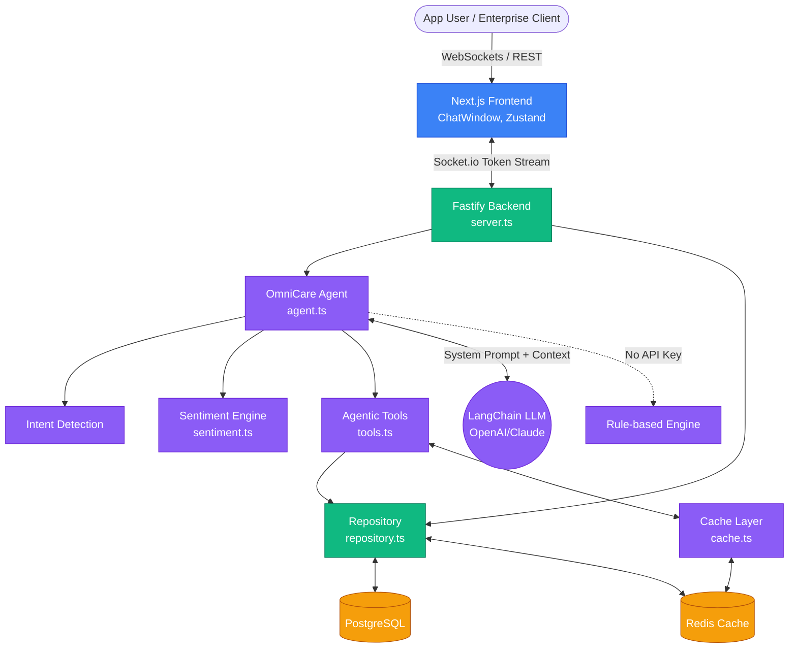

# 🚀 Flowzint OmniCare AI
### Next-Generation Enterprise Customer Support Platform

An AI-powered, full-stack customer care bot built for **Flowzint** — delivering real-time intelligent support with streaming responses, ticket management, and analytics.

---

## 🏗️ Tech Stack

| Layer | Technology |
|-------|-----------|
| **Frontend** | Next.js 16, React, Tailwind CSS |
| **State & Streaming** | Zustand, WebSockets (Socket.io) |
| **Backend API** | Node.js (TypeScript) / Fastify |
| **AI Orchestration** | LangChain / Intent-based routing |
| **LLM** | OpenAI GPT-4o / Claude 3.5 Sonnet |
| **Database** | PostgreSQL + Redis (with in-memory fallback) |
| **Infrastructure** | Docker, docker-compose |

---

## 🏛️ Architecture



---

## 📁 Project Structure

```
Project/
├── frontend/                    # Next.js 16 + Tailwind CSS App
│   └── src/
│       ├── app/
│       │   ├── layout.tsx       # Root layout + SEO metadata
│       │   ├── page.tsx         # Main app shell
│       │   └── globals.css      # Glassmorphism design system
│       ├── components/
│       │   ├── ChatWindow.tsx   # AI chat with token streaming
│       │   ├── Sidebar.tsx      # Navigation + connection status
│       │   ├── Header.tsx       # Panel header + SLA badges
│       │   ├── TicketPanel.tsx  # Create & manage support tickets
│       │   └── AnalyticsPanel.tsx # KPIs & performance dashboard
│       └── store/
│           └── chatStore.ts     # Zustand + Socket.io + persistence
│
├── backend/                     # Fastify + TypeScript API
│   └── src/
│       ├── server.ts            # Fastify + Socket.io + REST routes
│       ├── ai/
│       │   └── agent.ts         # LangChain GPT-4o + rule-based AI
│       └── db/
│           ├── client.ts        # PostgreSQL + Redis connections
│           └── repository.ts    # CRUD with in-memory fallback
│
└── docker-compose.yml           # Full stack: Postgres + Redis + Apps
```

---

## ⚡ Quick Start (Local Dev)

### 1. Start Backend
```bash
cd backend
npm install
npm run dev       # Runs on http://localhost:3001
```

### 2. Start Frontend
```bash
cd frontend
npm install
npm run dev       # Runs on http://localhost:3000
```

### 3. (Optional) Add AI Keys
Edit `backend/.env`:
```env
OPENAI_API_KEY=sk-...          # Enables GPT-4o streaming
ANTHROPIC_API_KEY=sk-ant-...   # Enables Claude 3.5 Sonnet
```
> Without keys, the app runs in **smart rule-based demo mode** — fully functional!

---

## 🐳 Full Stack with Docker

```bash
# Start everything (PostgreSQL + Redis + Backend + Frontend)
docker-compose up

# Stop everything
docker-compose down
```

| Service | URL |
|---------|-----|
| Frontend | http://localhost:3000 |
| Backend API | http://localhost:3001 |
| Health Check | http://localhost:3001/health |

---

## ✨ Features

- 🤖 **Real-time AI Streaming** — Token-by-token response via WebSockets
- 🎯 **Intent Detection** — Billing, API, Account, Integration, SLA, Technical
- 🎫 **Ticket Management** — Create, track, and manage support tickets
- 📊 **Analytics Dashboard** — KPIs, resolution rates, activity feed
- 💾 **Persistent History** — Sessions saved to PostgreSQL + Redis cache
- 🌑 **Glassmorphism UI** — Dark mode, animated orbs, micro-interactions
- 🔄 **Offline Resilience** — In-memory fallback when DB is unavailable

---

## 🔌 API Reference

| Method | Endpoint | Description |
|--------|----------|-------------|
| `GET` | `/health` | Service health check |
| `GET` | `/api/conversations/:sessionId` | Get chat history |
| `GET` | `/api/tickets` | List all tickets |
| `POST` | `/api/tickets` | Create a new ticket |

### WebSocket Events
| Event | Direction | Description |
|-------|-----------|-------------|
| `chat_message` | Client → Server | Send a user message |
| `chat_response` | Server → Client | Token stream (`start`, `token`, `done`) |
| `session_init` | Server → Client | Session ID assignment |

---

## 🏢 About Flowzint

Flowzint provides B2B automation solutions for enterprise workflows and AI pipelines.
- 📧 support@flowzint.com
- 🌐 flowzint.com
- 📊 status.flowzint.com
